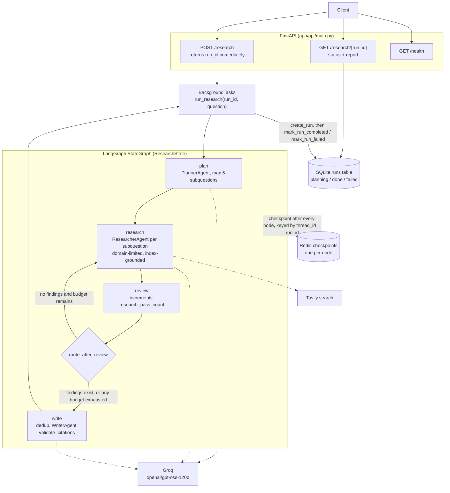

# System Architecture

**Status:** Living document, updated as the project evolves.
**Last updated:** after Phase 5 (reliability: budgets, persistence, checkpointing) and the first FastAPI layer.

## Overview

The Multi-Agent Research Assistant takes a research question, plans subquestions,
researches each one with web search, deduplicates evidence, writes a structured
report, and rejects the report if any citation does not map to a real finding.
Runs execute in the background; clients poll by `run_id`.

Architecture style: a rule-based supervisor (the Reviewer) over sequential workers,
compiled as a LangGraph `StateGraph` with one conditional loop-back edge and a
Redis-backed checkpointer.

## Diagram

## Component responsibilities

| Component | Responsibility |
|---|---|
| `LLMClient` | Wraps Groq. Retries 429s using the `retry-after` header. Retries Pydantic validation failures with corrective feedback. Treats Groq `json_validate_failed` 400s as a validation failure inside the same bounded retry budget. Other 400s are not retried. |
| `SearchClient` | Thin Tavily wrapper with an explicit timeout. |
| `PlannerAgent` | One structured call producing a `ResearchPlan`. The 5-subquestion cap is a Pydantic `max_length`, not a prompt instruction. |
| `ResearcherAgent` | Search, limit results per domain, then the LLM returns claims as `source_index` pointers. Our code builds the real `Source`. Out-of-range indices are skipped. |
| `WriterAgent` | Writes the report from deduplicated findings, then calls `validate_citations`. |
| `validate_citations` | LLM-free. Raises `CitationValidationError` if any `finding_id` is not a real finding. |
| `route_after_review` | Chooses `research` or `write` from state. All limits are enforced here. |
| `run_research` | Lifecycle wrapper: `create_run`, invoke the graph with `thread_id = run_id`, then `mark_run_completed` or `mark_run_failed` (and re-raise). |
| `run_store` | SQLite persistence for the run record. `db_path` is injectable for tests. |
| `make_checkpointer` | Builds the Redis saver with an exact-symbol serializer allowlist (see below). |

## Budgets (enforced in code, not prompts)

| Limit | Value | Where |
|---|---|---|
| Subquestions per plan | 5 | `ResearchPlan` Pydantic constraint |
| Research passes | 2 | `MAX_RESEARCH_PASSES`, `route_after_review` |
| Total searches | 15 | `MAX_TOTAL_SEARCHES`, `route_after_review` |
| Wall-clock duration | 180 s | `MAX_RUN_DURATION_SECONDS`, `route_after_review` |
| Results per domain | 2 | `MAX_RESULTS_PER_DOMAIN`, `ResearcherAgent` |
| Validation retries | 2 | `LLMClient.generate` |
| Rate-limit retries | 3 | `LLMClient` |
| Per-call timeouts | 20 s | Groq client, Tavily `search` |

## Checkpointing and resume

Every node's state is written to Redis, keyed by `thread_id` (the `run_id`).
`scripts/test_resume.py` runs `plan`, abandons that graph object, builds a fresh
graph, and resumes with `invoke(None, config)`. Verified output: the checkpoint's
next node was `research`, the nodes run after resume were `research, review, write`,
and the plan was unchanged.

**Serializer gotcha.** The default `JsonPlusRedisSerializer` has an empty JSON
allowlist. For unlisted classes it does not raise; it returns the raw
`{'lc': 2, ...}` dict, and a revival failure logs a warning and returns `None`.
Symptoms were `ValidationError` on resume and `None` findings. Fixes:

- `make_checkpointer` sets `allowed_json_modules` to the exact module/class tuples
  of our state models, derived from the classes themselves. We did not use
  `allowed_json_modules=True`, which the library labels dangerous.
- `Source.url` is a validated `str`. Pydantic's `HttpUrl` serializes to
  `pydantic_core` envelopes that the loader could not rebuild.
- `tests/integration/test_checkpoint_roundtrip.py` asserts nested objects
  come back as real models, not just that nothing crashed.

## External service constraints (verified 2026-09-20 against live dashboards)

- **Groq**: free tier, limits per model per organization. `openai/gpt-oss-120b`:
  30 RPM, 1,000 RPD, 8,000 TPM, 200,000 TPD. Re-check
  `console.groq.com/settings/limits`; providers change these.
- **Tavily**: free "Researcher" plan, 1,000 credits per month, no overage billing.

## Known limitations

- **Status is coarse.** `runs.status` is `planning`, `done`, or `failed`. A run
  killed mid-flight stays `planning` forever. Progress is visible only through
  checkpoints.
- **Resume is not exposed.** Nothing resumes a crashed run automatically or via
  the API. Proven by script only.
- **The crash was simulated.** The resume test stops iterating in the same
  process; no process was killed. Whether a hard kill can lose the last node's
  checkpoint is untested.
- **Checkpoint granularity.** `research_node` loops all subquestions inside one
  node, so one failure discards the others' work.
- **Loop-back is narrow.** `route_after_review` loops only when there are zero
  findings. There is no sufficiency or contradiction judgment.
- **Evidence is snippet-based** (Tavily `content`), not full pages.
- **Unauthenticated API.** The unguessable `run_id` is the only access control.
  No cancel endpoint, no trace endpoint, no rate limiting.
- **Writer formatting.** Inline citation markers in prose appear as literal
  bracketed IDs.
- **Redis container** has no volume; recreating it loses checkpoints.
- Not built yet: parallel fan-out, contradiction detection, arXiv, tracing,
  evaluation harness, Docker packaging.

## Phase log

- **Phase 0:** `uv`, Python 3.12.5, `ruff`, Git/GitHub, `Settings`.
- **Phase 1:** Groq connection, structured outputs, `LLMClient` retries.
- **Phase 2:** Planner, Researcher, Writer, each live- and unit-tested.
- **Phase 3:** LangGraph state, nodes via factory functions, conditional routing.
- **Phase 4 (partial):** domain limiting, URL normalization and deduplication.
- **Phase 5:** budget dimensions, timeouts, SQLite run store, Redis checkpointing
  with the serializer allowlist, resume verified by script.
- **Phase 7 (partial):** FastAPI with background execution, 3 endpoints, tested.
- **Since:** `json_validate_failed` handling; Redis URL moved into `Settings`.