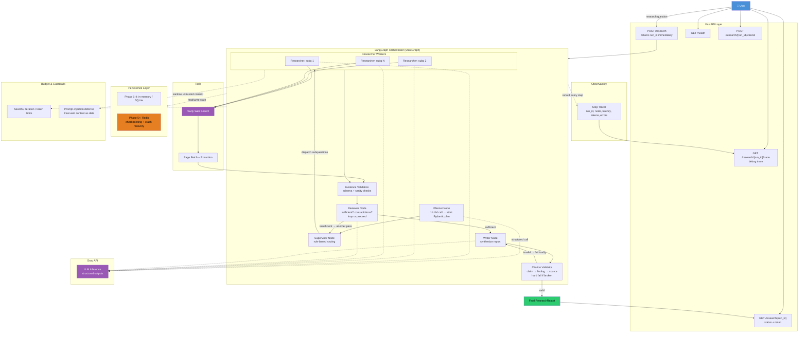

# System Architecture

**Status:** Living document — updated as the project evolves through phases.
**Last updated:** Phase 0 (project scaffolding)

## Overview

The Multi-Agent Research Assistant takes a research question, plans it into
subquestions, dispatches researcher agents to gather evidence from the web,
validates and synthesizes findings, and returns a citation-checked report.

Architecture style (current): **centralized supervisor + worker pattern**,
sequential subquestion processing. Parallel fan-out/fan-in is a planned
upgrade for a later phase — see Phase log below.

## Diagram

## Component responsibilities

| Component | Responsibility |
|---|---|
| FastAPI layer | Accepts requests, returns `run_id` immediately, exposes status/trace polling |
| Planner node | One structured LLM call → research plan + subquestions (Pydantic-validated) |
| Supervisor node | Rule-based routing: dispatch work, decide on re-research passes |
| Researcher workers | Search + fetch + extract evidence per subquestion, with provenance |
| Evidence validation | Schema and sanity checks before findings enter shared state |
| Reviewer node | Decides sufficiency, detects contradictions, loops back or proceeds |
| Writer node | Synthesizes structured report from validated findings only |
| Citation validator | Hard-fails the report if any claim can't be traced to a real source |
| Persistence layer | Run state storage; SQLite/in-memory early, Redis from Phase 5 for checkpointing |
| Observability | Step-level trace: node, input/output, latency, tokens, errors |
| Budget & guardrails | Enforces hard limits on searches/iterations/tokens; treats web content as untrusted |

## Known simplifications (current phase)

- No Redis yet — introduced deliberately in Phase 5 alongside checkpointing/crash-recovery teaching.
- No parallel worker execution yet — sequential subquestion processing until the sequential path is proven correct.
- No contradiction detection yet — planned as LLM-based pairwise claim comparison, not embedding/NLI-based (cost and complexity tradeoff, documented limitation).
- No long-term/episodic memory — deliberately excluded; each run is self-contained.

## Phase log

- **Phase 0 (current):** Project scaffolding, `uv`, `ruff`, package skeleton, Git/GitHub setup.