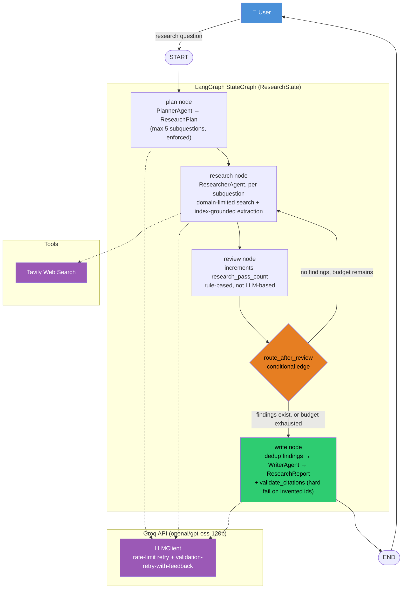

# System Architecture

**Status:** Living document — updated as the project evolves through phases.
**Last updated:** Phase 3-4 (LangGraph core + research system quality controls)

## Overview

The Multi-Agent Research Assistant takes a research question, plans it into
subquestions, dispatches a researcher agent to gather evidence from the web,
validates and deduplicates findings, and returns a citation-checked report.

Architecture style (current): **centralized, rule-based supervisor (Reviewer)
with sequential subquestion processing**, compiled and executed as a LangGraph
`StateGraph` with one conditional loop-back edge. Parallel fan-out/fan-in across
subquestions remains a planned upgrade for a later phase.

## Diagram

## Component responsibilities

| Component | Responsibility |
|---|---|
| `LLMClient` | Rate-limit retry (verified against real Groq SDK internals) + validation-retry-with-feedback, bounded by `max_validation_retries` |
| `SearchClient` | Thin wrapper over Tavily, no business logic |
| `PlannerAgent` | One structured LLM call → `ResearchPlan`, hard-capped at 5 subquestions via Pydantic `max_length` |
| `ResearcherAgent` | Per-subquestion: search → domain-limit results → LLM extracts claims as index pointers (never raw URLs) → own code resolves real `Source` data; skips out-of-range indices rather than crashing |
| `review_node` | Rule-based pass-counter increment; routing decision lives in `route_after_review`, not inside the node |
| `route_after_review` | Conditional edge: loop back to `research` if findings are empty and budget remains; otherwise proceed to `write` |
| `WriterAgent` | Deduplicates findings (URL-normalized) at point of use, synthesizes `ResearchReport`, calls `validate_citations` before returning |
| `validate_citations` | Standalone, LLM-free function; hard-fails if any `Citation.finding_id` doesn't match a real `Finding.id` |
| `dedup.py` | `normalize_url` (strips query/fragment/trailing slash) + `deduplicate_findings`, applied once at write time to avoid reducer conflicts |

## Known simplifications (current phase)

- No Redis yet — introduced deliberately in Phase 5 alongside checkpointing/crash-recovery teaching.
- No parallel worker execution yet — subquestions processed sequentially inside `research_node`.
- `review_node`'s sufficiency check is a single rule (`len(findings) == 0`) — real evidence-sufficiency judgment, contradiction detection, and missing-source detection are deferred to Phase 6.
- No contradiction detection yet.
- Evidence is snippet-based (Tavily `content` field), not full-page extraction — open question, not yet resolved.
- No long-term/episodic memory — deliberately excluded; each run is self-contained.
- No arXiv integration yet — deferred; `Source`/`Finding` schemas are source-type-agnostic enough to extend later without a retrofit.
- Domain limiting and URL deduplication are real, tested, and active — not simplifications, genuinely implemented.

## Phase log

- **Phase 0:** Project scaffolding, `uv`, `ruff`, package skeleton, Git/GitHub setup.
- **Phase 1:** `Settings`, live Groq connection, structured-output pattern, `LLMClient` with verified rate-limit and validation retry, fully unit-tested.
- **Phase 2:** `PlannerAgent`, `ResearcherAgent`, `WriterAgent` built independently, each live-tested end-to-end and unit-tested with mocks. Citation grounding (index-based, not LLM-typed URLs) established as a core pattern here, reused later.
- **Phase 3:** LangGraph `StateGraph` — typed `ResearchState` with an accumulation reducer for `findings`; nodes built via dependency-injected factory functions (LangGraph's fixed `node(state)` signature required a closure-based pattern, not plain constructor injection); fixed + conditional edges; Reviewer node added with rule-based, budget-bounded routing. Full graph compiled and run live end-to-end.
- **Phase 4 (partial):** Domain limiting inside `ResearcherAgent`; URL normalization and cross-subquestion deduplication applied at write time (deliberately not inside `review_node`, to avoid conflicting with the `findings` reducer). Both unit-tested in isolation and proven in live runs.